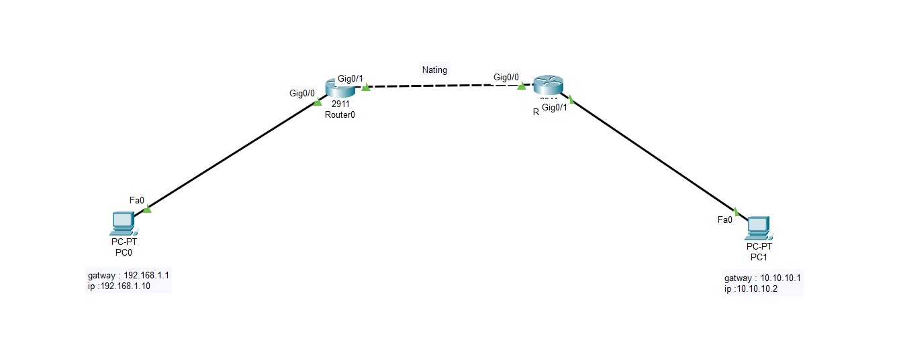

# Sample-nat
# 🌐 NAT Configuration Project

A simple project to demonstrate how **Network Address Translation (NAT)** works in a small network using Cisco routers.

## 📌 Goals
- Configure **Static NAT**
- Test internal and external connectivity
- Understand real-world use cases

---

## ⚙️ Configuration Files

All configuration files are inside the `config/` directory:
- `router1.txt` – NAT setup on the router
- `router2.txt` – NAT setup on the router
- `pcs.txt` – IP addresses of internal clients

---

## 🧪 How to Test
- Ping from inside PC to public IP
- Use `show ip nat translations`
- Use `debug ip nat`

---

# 📷 Photos

  

## 🛠 Tools Used
- Cisco Packet Tracer
- GNS3 (optional)

> ⚠️ License Notice:
> This project was previously licensed under [MIT](LICENSE). As of 2025-07-04, it is now licensed under [Apache 2.0](LICENSE).
